# Sathi (সাথী) 🇧🇩

> **A Bangla-First AI Financial Copilot for Mobile-Wallet Users**  
> Built for **AI Hackathon 2026**, Track 03: *Customer Innovation & Financial Independence*  
> Organized by **DIU Computer and Programming Club (DIU-CPC)** × **উপায় (upay)**, Daffodil International University.

[](LICENSE)
[]()
[]()
[]()
[]()

> 🌐 **Live web app:** <https://sathi-pied.vercel.app> &nbsp;·&nbsp; 📱 **Android APK:** [Download from Releases](https://github.com/AdilShamim8/Sathi/releases/latest) &nbsp;·&nbsp; 🧪 Try it instantly with **“Explore with demo data”** on first launch

---

## 📸 App Screenshots

**Dashboard — Safe-to-Spend, shortfall risk & financial health** (live deployment, demo data):

<p align="center">
  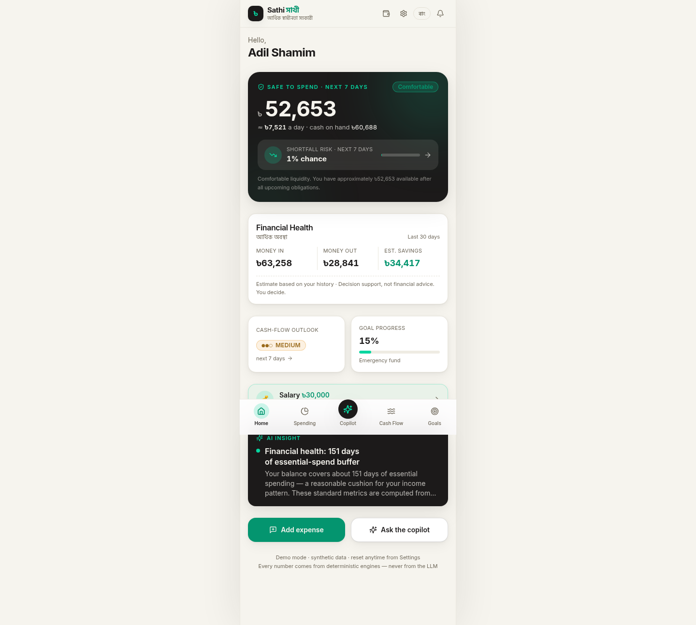
</p>

**The five core views** — the Android APK and the website run the exact same code and show the exact same numbers:

| | | |
|:---:|:---:|:---:|
| **Home**<br>Safe-to-Spend & risk | **Spending**<br>Category intelligence | **Copilot**<br>Grounded Bangla chat |
| 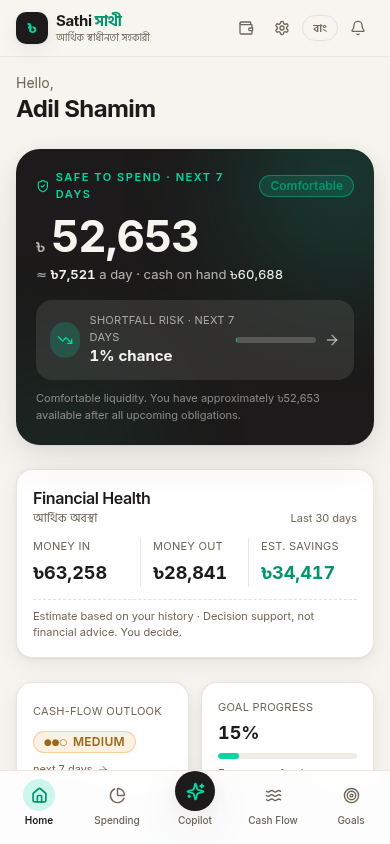 |  | 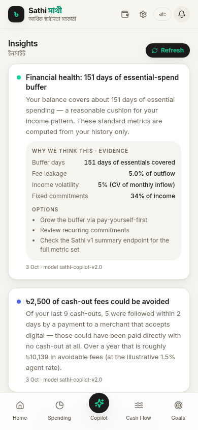 |
| **Cash Flow**<br>Forecast & pressure | **Goals**<br>Monte Carlo plans | **Insights**<br>Evidence-backed advice |
| 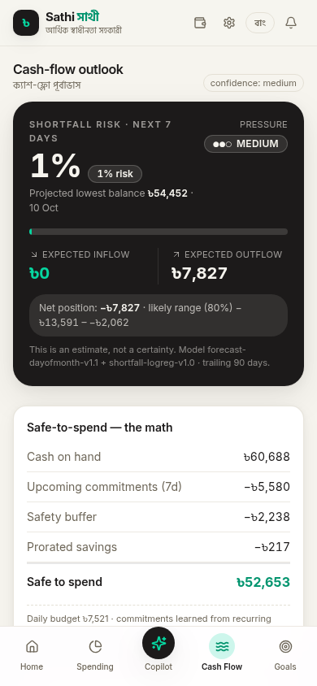 | 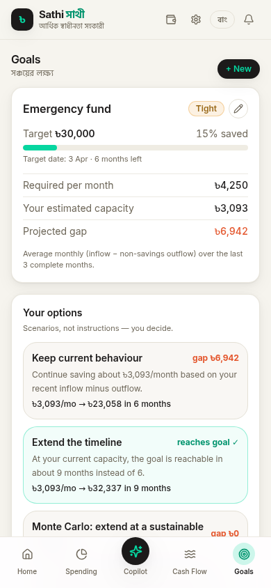 | 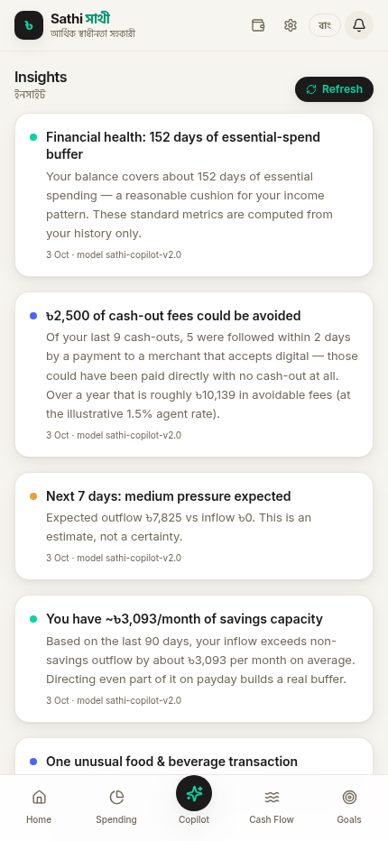 |

<details>
<summary><b>📂 Full UI gallery</b> — onboarding, transactions, Bangla mode, salary & settings</summary>

| | | |
|:---:|:---:|:---:|
| 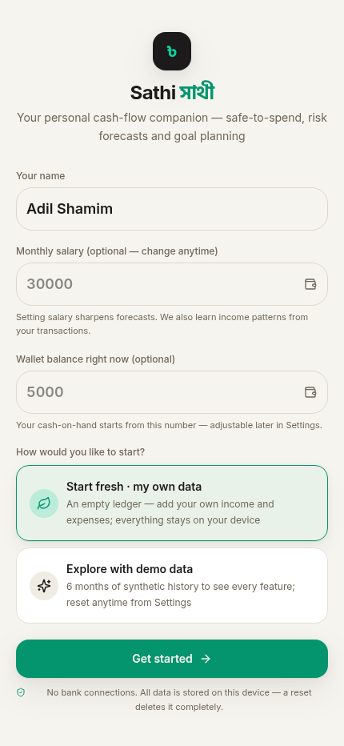 | 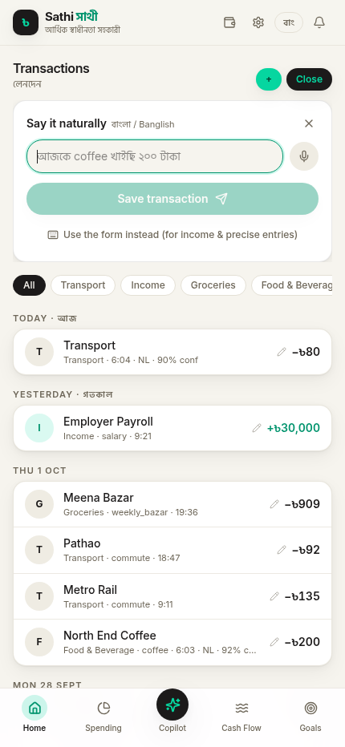 | 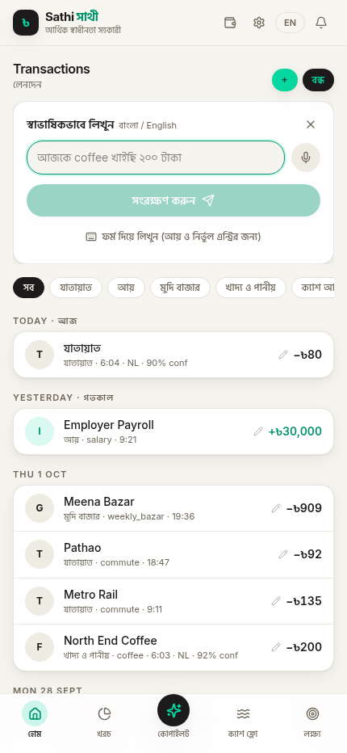 |
| 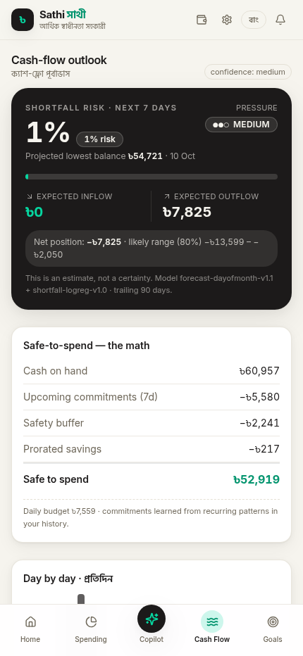 | 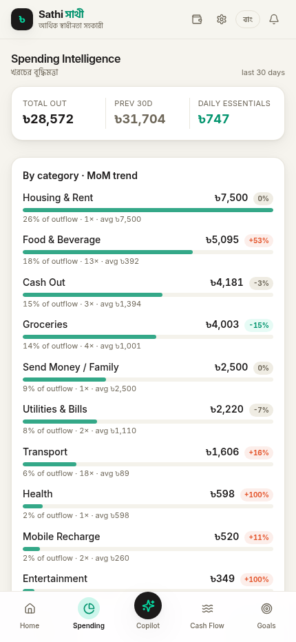 | 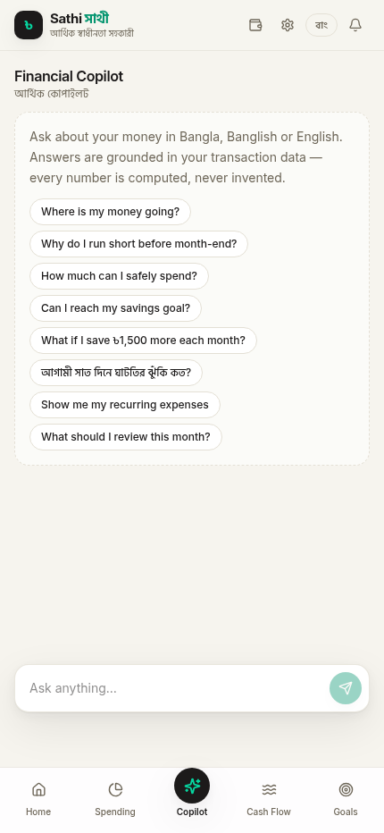 |
| 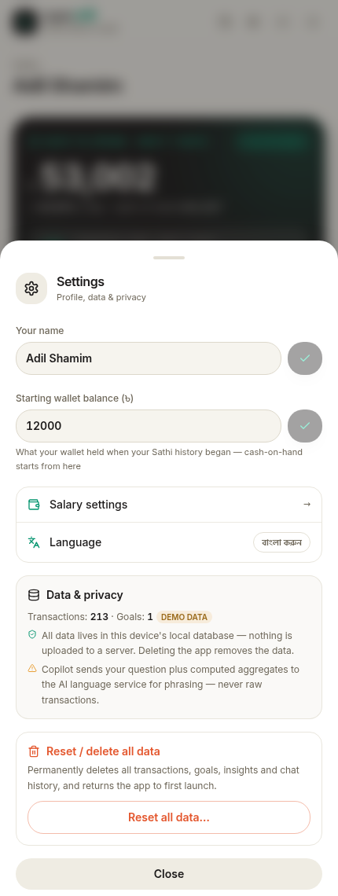 |  | 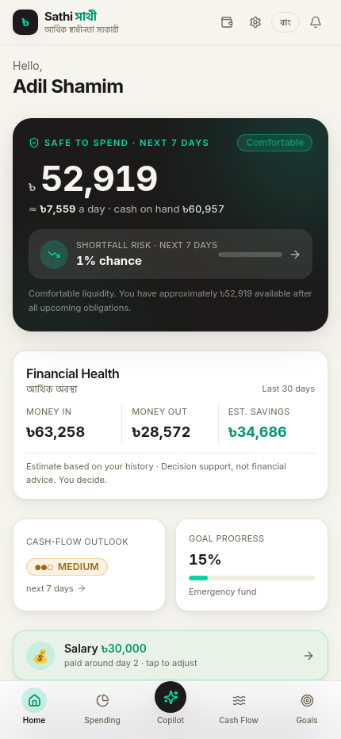 |

</details>

---

## 1. Project Overview

Many low- and irregular-income mobile financial service (MFS) users have access to digital payments but lack financial control. Income arrives at one time while household obligations arrive at another; users discover shortfalls only in the last week of the month, forcing them into informal borrowing or skipping essentials. In addition, habitual small cash-outs lead to significant fee leakage while taking money off the digital trail.

**Sathi (সাথী)** turns transaction history into actionable tools that keep every financial decision strictly in human hands:

1. **Safe-to-Spend Today:** A single defensible number — wallet total minus commitments, essentials buffer and prorated savings — now computed **by the ML model** (rule baseline always kept beside it).
2. **Shortfall Forecasting:** LightGBM quantile forecasts ($p_{10}, p_{50}, p_{90}$) + calibrated balance-path simulation give a **calibrated probability** of running short before the next income arrives — never a misleading point estimate.
3. **Plain Bangla Copilot:** Ask in Bangla, Banglish or English; an LLM narrates deterministic engine results under a strict numeric validator that **fails closed** to templates.
4. **Natural-Language Capture:** `আজকে রিকশা ভাড়া ৮০ টাকা` becomes a parsed transaction with a preview before saving (100% amount + category accuracy on the labelled holdout).
5. **Feasible Goal Planning:** Monte Carlo savings paths with Wilson 95% intervals and three honest option types (goal date / monthly amount / probability).
6. **Cash-Out Conversion Audit:** Repeat-agent cash-outs mapped to digital-capable merchants with avoidable fees at the labelled rate.
7. **Salary-Aware Forecasting:** Optional salary amount + pay-day refines every projection.

### The Track 03 Big Question
> *"How might an MFS platform help customers become more financially confident and independent, not merely more active users?"*

Sathi's answer: **Empower the customer with foresight, clear trade-offs, and honest options, keeping all financial decisions strictly in human hands.** Sathi never moves money, never determines credit underwriting, and never nudges spending.

---

## 2. Key Features & AI Advantage

| Capability | How AI & Engineering Are Applied | Why a Simple Rule Is Insufficient |
| :--- | :--- | :--- |
| **Shortfall Forecasting** | LightGBM quantile regression (9 quantiles) on leakage-safe features + recurring-stream detection + calibrated path sampling | Fixed rules fail under lumpy income dates and volatile expenses; calibrated probability reflects true risk (Brier 0.024 vs rule 0.053). |
| **Safe-to-Spend** | Model-based daily budget from forecast paths (P(shortfall) = α by construction); rule formula kept as baseline | Static buffers ignore the user's actual income timing and upcoming obligations. |
| **Goal Feasibility** | Monte Carlo simulation over historical inflow/outflow distributions with Wilson 95% CI | Simple "save 20%" rules ignore irregular timing and overestimate feasibility, leading to abandoned goals. |
| **Bangla Copilot** | LLM orchestrator for intent routing and natural narration with a strict numeric validator | Translates complex figures into culturally native Bangla while strictly enforcing deterministic math. |
| **NL Transaction Capture** | Deterministic Bangla/Banglish/English parser (amount + category + merchant) with confirmation step | Typing forms is high-friction on low-end phones; free text is natural but must never guess wrong silently. |
| **Cash-Out Insights** | Deterministic transaction cluster analysis mapping recurring cash withdrawals to digital merchant rails | Accurately calculates true fee savings and digital retention potential. |

---

## 3. System Architecture & Tech Stack

```
          OFFLINE (Developers / CI — repo root, the "ML factory")
 data_gen/ ─► Seeded Dataset ─► ml/ (Features → Train → Calibrate → Evaluate T1–T7)
     │                              │
     └─► Demo Bundler ─► web/public/demo/*.json          promote (copy)
                                                           │
          ONLINE (Request Flow — web/, the deployable app) ▼
 Android APK (Capacitor) ──┐                       web/ml-artifacts/forecast/
 Web App (Next.js 16) ─────┼──► web/src/app/api — 26 routes · 32 handlers
        │                  │         │
        │  /api/v1/* — the reference Sathi contract (13 routes: personas,
        │             demo JWT, evidence blocks, fail-closed chat)
        └──► web/src/lib/engine — pure deterministic TypeScript engines
                 │   (money, categorizer, simulation, planner, cashout,
                 │    safe-to-spend, LightGBM predictor, forecaster…)
                 └──► llm chain: sanitize → intent → context → LLM draft
                        → numeric validation → template fallback (fail-closed)

  Reference twin: `make run` serves the same v1 contract from the Python
  backend (api/ FastAPI) on :8000 — the app reproduces it bit-compatibly.
```

### Technology Stack
- **Web app (`web/`):** Next.js 16 App Router, React 19, TypeScript (strict), Tailwind CSS 4, Prisma (SQLite), z-ai LLM SDK; standalone output for Vercel/self-hosting
- **Backend factory (repo root):** Python 3.11+, FastAPI, Pydantic v2 — the reference service and the training pipeline
- **Data & ML:** pandas, NumPy, LightGBM 4.6.0 (quantile loss, 9 quantiles), scikit-learn, SHAP
- **Storage:** SQLite (WAL mode) — `web/db` for the app, `data/` for the pipeline
- **Native Android Shell:** Capacitor (`web/android`, `com.upay.sathi`) loading the deployed app
- **CI/CD:** GitHub Actions — `backend-ci.yml` (78 pytest + data verification), `app-ci.yml` (83 TS tests, lint, type-check, build), `android-apk.yml` (debug APK + GitHub Release)

### Deploying (Vercel / self-hosted)

The app is serverless-ready: on a fresh or empty database it creates its own schema and seeds on first request (no `db push` needed).

1. Import this GitHub repo into Vercel with **Root Directory: `web`**.
2. Deploy — no environment variables required. Install (bun), build command and framework (Next.js) are auto-detected; `ml-artifacts/` is traced into the functions so model forecasts work.
3. **How the database works on serverless:** `web/src/lib/db.ts` detects the Vercel environment and redirects the SQLite file to an auto-created writable copy under `/tmp` (the rest of the filesystem is read-only). The data layer's `ensureSchema()` builds the tables on first request — zero-config cold start. Setting `DATABASE_URL` on Vercel is optional; `file:` URLs are redirected to `/tmp` automatically, and remote provider URLs (`libsql://`, `postgres://`, …) pass through untouched.
4. **Know the trade-off:** data lives per serverless instance and resets on cold starts — fine for a demo. For persistent hosted data, point `DATABASE_URL` at Postgres (change `provider` in `web/prisma/schema.prisma`, run `bun run db:push` once) or self-host:

```bash
cd web && bun install && bun run db:push && bun run build
DATABASE_URL=file:./db/custom.db PORT=3000 bun run start   # standalone server
```

The Android shell loads whichever deployment URL you set in `web/capacitor.config.json`.

---

## 4. Architectural Invariants (Non-Negotiables)

1. **LLM Never Computes Money:** The LLM only routes user intent and narrates engine results. All math is deterministic.
2. **Numeric Validator Fails Closed:** Every number emitted by the LLM is validated against engine outputs; unverified figures fail closed to a deterministic Bangla template.
3. **Pure Core:** `core/` (Python) and `web/src/lib/engine/` (TypeScript) contain pure business logic with zero I/O, no database access, no network calls, and no clock reads.
4. **Integer Paisa:** Money is strictly integer paisa (`paisa`) throughout the backend, database, and client types.
5. **Display Strings Only:** The frontend renders read-only `display` strings generated by the server and never performs money arithmetic.
6. **Evidence Blocks:** All user insights include an `evidence` block with labelled figures (`Data`, `Prediction`, `Assumption`, `Generated`).
7. **Offline Demo Resilience:** The mobile APK includes an offline demo data bundle with 5 distinct personas and never presents a blank screen.
8. **No Hand-Typed Metrics:** every published number is generated by `ml/evaluate.py` and served verbatim from the artifacts.
9. **Leakage-Safe Features:** every model feature is computed strictly before the forecast origin — enforced by tests on both the Python and TypeScript sides.

---

## 5. Personas

Sathi is validated across 5 synthetic personas (see `config/personas.yaml`, ported to `web/src/lib/engine/sathiPersonas.ts`):
1. **Rina (Hero Persona):** Salaried garment worker with fixed monthly salary on the 7th, front-loaded obligations, and month-end liquidity squeeze.
2. **Remittance Household:** Irregular, lumpy inflows from overseas family members.
3. **Gig / Ride-Share Driver:** Daily volatile income with high-frequency fuel and maintenance outlays.
4. **Student:** Sporadic small family allowances with limited transaction history.
5. **Small Merchant / Shopkeeper:** Mixed personal and micro-business transactions with heavy cash dependency.

---

## 6. Repository Layout & Documentation Map

```
├── README.md                    # Project overview & quickstart (this file)
├── LICENSE                      # Apache 2.0 Open Source License
├── Makefile                     # Backend + web commands (verified)
├── requirements.txt             # Python dependencies (pinned)
├── sathi_config.py              # YAML config loader (fees, personas, risk…)
├── api/                         # Reference FastAPI service (v1 contract twin)
├── core/                        # Pure deterministic engines (money, planner,
│                                #   simulation, categorizer, cashout, metrics…)
├── llm/                         # Sanitizer → validator → orchestrator → templates
├── ml/                          # Training & evaluation: train, calibrate,
│                                #   evaluate (T1–T7), features, inference
├── config/                      # 7 YAML assumption files
├── data_gen/                    # Seeded synthetic generator + demo bundler
├── data/                        # Generated parquet panel + ground truth
├── tests/                       # 78 pytest tests (engines, API, data, forecast)
├── context/                     # Architectural specs & working guides
│   ├── Hackathon Rule Context/  #   Official DIU-CPC × upay hackathon documents
│   └── context/                 #   architecture, code-standards, ui-context…
├── docs/                        # eval_report.md (T1–T7), model-card.md,
│                                #   metrics/, diagrams/, screenshots,
│                                #   HACKATHON_COMPLIANCE.md (§13/§14/§15 matrix)
├── scripts/                     # Repo utilities (fixture gen, diagrams, smoke)
└── web/                         # ★ The deployable Next.js app
    ├── src/                     #   App Router UI (7 views, EN/বাংলা) + 26 API
    │                            #     routes incl. /api/v1/* (13 reference routes)
    ├── prisma/                  #   Schema (User, Transaction, Goal, Insight,
    │                            #     KnowledgeDoc, AuditEvent, ForecastRecord)
    ├── ml-artifacts/            #   Promoted model (9 boosters + calibration)
    ├── tests/                   #   83 TypeScript tests (parity, leakage, CRUD)
    ├── scripts/                 #   App-side dev utilities
    ├── public/demo/             #   Offline persona bundles (5 personas)
    ├── android/                 #   Capacitor shell (com.upay.sathi)
    └── capacitor.config.json    #   APK points at the deployed URL
```

---

## 7. Requirements & Prerequisites

- **Python:** 3.11 or higher
- **Bun:** v1.1+ (or Node.js 20 with npm — commands below use bun)
- **Android SDK:** (Optional, for local APK builds; GitHub Actions handles CI builds)
- **Operating System:** Windows, macOS, or Linux

---

## 8. Installation & Setup

### 1. Clone the Repository
```bash
git clone https://github.com/AdilShamim8/Sathi.git
cd Sathi
```

### 2. Backend Setup (the ML factory — optional for running the web app)
```bash
python -m venv .venv
# On Windows:
.venv\Scripts\activate
# On Linux/macOS:
source .venv/bin/activate

pip install -r requirements.txt
```

### 3. Web App Setup (the deployable product)
```bash
cd web
bun install          # also runs `prisma generate`
cp .env.example .env # DATABASE_URL preconfigured (file:../db/custom.db)
bun run db:push      # create the SQLite schema (fresh DB auto-seeds on first load)
```

---

## 9. Environment Variables

**`web/.env`** (the Next.js app — copy from `web/.env.example`):

| Variable | Purpose |
|---|---|
| `DATABASE_URL` | SQLite connection string (preconfigured to `file:../db/custom.db`, relative to `web/prisma/`) |
| `SATHI_ML_ARTIFACTS` | (optional) override the model artifacts directory; defaults to `./ml-artifacts/forecast` |
| (optional) AI gateway credentials | If absent, the copilot runs in deterministic mode — all features still work |

**`.env`** (repo root — the Python backend; copy from `.env.example`): `APP_ENV`, `DATABASE_URL` (python format `sqlite:///./data/sathi.db`), `AUTH_SECRET`, `ALLOWED_ORIGINS`, `LLM_*` (the backend works end to end with `LLM_ENABLED=false`).

> **Security Note:** Secrets and server keys are never committed to git or exposed to the client bundle.

---

## 10. Run and Build Commands

| Target | Command | Purpose |
| :--- | :--- | :--- |
| **Web Dev Server** | `make web-dev` (or `cd web && bun run dev`) | Start the Next.js app on :3000 |
| **Web Production Build** | `make web-build` | Standalone build in `web/.next/standalone` (ships `ml-artifacts/`) |
| **Web Tests / Lint** | `make web-test` / `make web-lint` | 83 TS tests / ESLint + type-check |
| **Backend Dev Server** | `make run` | Reference FastAPI v1 service on :8000 |
| **Dataset Generation** | `make data` | Seeded synthetic panel (2,000 users + 500 drifted) |
| **Train / Evaluate** | `make train` / `make eval` | 9-quantile boosters / T1–T7 metrics (offline only) |
| **Demo Bundles** | `make demo-bundle` | Regenerate `web/public/demo/*.json` |
| **Capacitor Android Sync** | `cd web && npx cap sync android` | Sync app assets into `web/android` |
| **Android APK Build** | GitHub Actions (`.github/workflows/android-apk.yml`) | Public debug-signed APK + Release |

---

## 11. Testing & Code Quality

```bash
# Backend test suite (root)
pytest                        # → 78 passed

# Backend lint & static analysis
ruff check . && mypy core api llm

# Web app tests, lint, type-check, build (web/)
cd web
bun test                      # → 83 passed (engines, ML parity, CRUD)
bun run lint
bunx tsc --noEmit
```

**API smoke tests** (dev server running — all return 200):
```bash
curl localhost:3000/api/boot          # owner status (needsOnboarding + mode)
curl localhost:3000/api/summary       # snapshot + safe-to-spend + shortfall risk
curl localhost:3000/api/forecast      # forecast + ML risk + evidence + action cards
curl localhost:3000/api/metrics       # ML validation vs rule baseline + parser accuracy

# Sathi v1 API (reference contract, model-driven):
TOKEN=$(curl -s -X POST localhost:3000/api/v1/auth/demo-login \
  -H 'Content-Type: application/json' \
  -d '{"user_id":"garment_worker"}' | python3 -c 'import sys,json;print(json.load(sys.stdin)["token"])')
curl -H "Authorization: Bearer $TOKEN" localhost:3000/api/v1/me/forecast   # lightgbm-quantile + streams + calibrated paths
curl -H "Authorization: Bearer $TOKEN" localhost:3000/api/v1/me/summary    # safe_to_spend.method: "model"
curl -H "Authorization: Bearer $TOKEN" localhost:3000/api/v1/me/benchmark  # T1–T7 from the generated eval artifacts
```

**Validation highlights** (generated, never hand-typed — `docs/eval_report.md`): forecaster Brier **0.024** vs rule **0.053** (BSS vs rule **+0.546**), pinball improvement **+4.9%** over the best baseline, daily p10–p90 coverage **84.7%** (nominal 80%). In-product classifier (frozen test users): ML Brier **0.056** vs simple-rule **0.066** (BSS **+15%**), PR-AUC **0.978** vs **0.879**. NL parser: **100%** amount / **100%** category on the labelled holdout. The TypeScript LightGBM predictor matches the Python booster **exactly** (9 models × 24 fixture rows, diff 0 — `web/tests/fixtures/lgb-predictions.json`).

---

## 12. Deliverables & Hackathon Roadmap

- **Live Web URL:** <https://sathi-pied.vercel.app> — deployed on Vercel (Root Directory `web`), zero-config serverless SQLite
- **Android APK:** [`sathi-v6.0.0-debug.apk`](https://github.com/AdilShamim8/Sathi/releases/latest) — built automatically on every push by GitHub Actions and published as a public GitHub Release; the shell loads the live deployment
- **Compliance matrix:** [`docs/HACKATHON_COMPLIANCE.md`](docs/HACKATHON_COMPLIANCE.md) — §13 Product Readiness, §14 Responsible AI & Safety, §15 Evaluation, with an evidence pointer for every line
- **Responsible AI:** synthetic data only (no real PII; every ML number labelled SIMULATED); LLM guardrails (numeric grounding, deterministic fallback, no autonomous decisions); model guardrails (leakage-safe features enforced by test, held-out calibration, fail-closed serving); `audit_events` records every capture, forecast and query
- **Submission Milestone:** demo video + technical report at T+66h

---

## 13. License & Attribution

- **License:** Apache License 2.0 — see [LICENSE](LICENSE) for details.
- **Academic & Competition Context:** Developed for AI DEV FEST 2026 AI Hackathon by DIU-CPC and upay.
- **Third-Party Libraries & AI Disclosures:** Documented in [`docs/third_party.md`](docs/third_party.md) per Hackathon Rulebook §4.4.
- **Design & Code Lineage:** UI/UX inspired by Origin (useorigin.com) design language; engines ported from the Sathi Python reference (core, ML pipeline, LLM fail-closed chain) and the first-version upay Copilot prototype. All data is synthetic.
