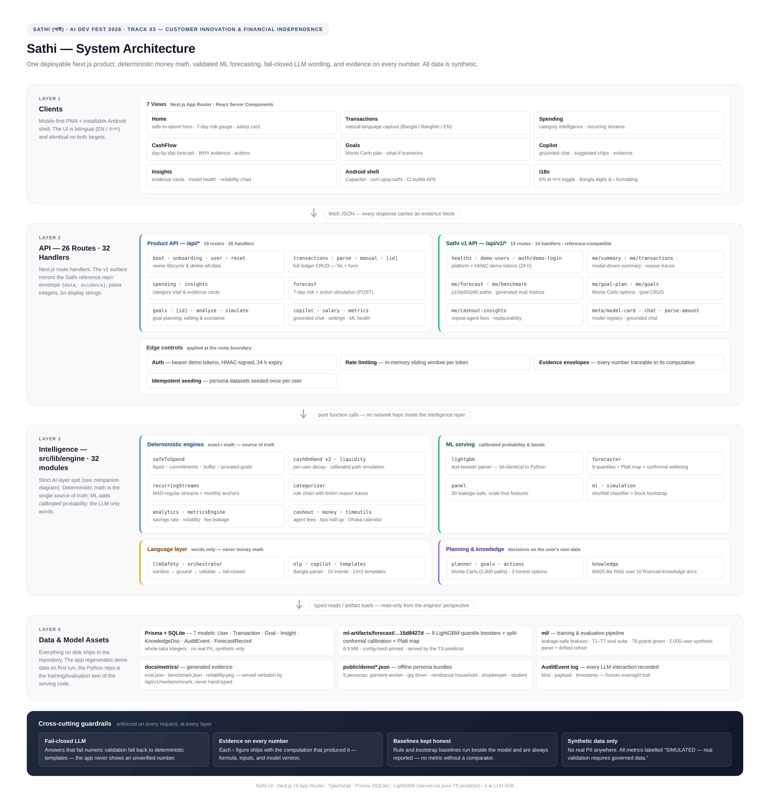
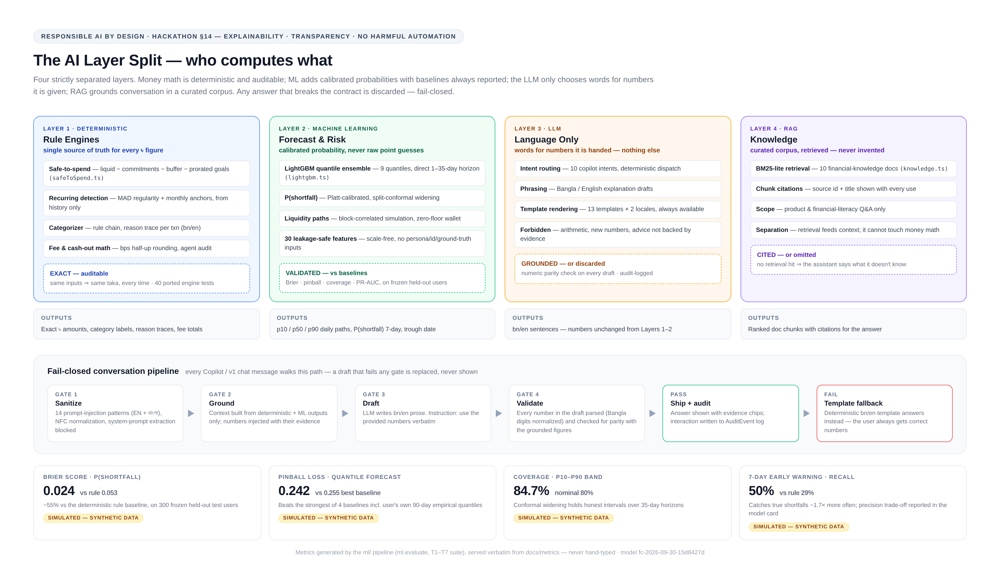
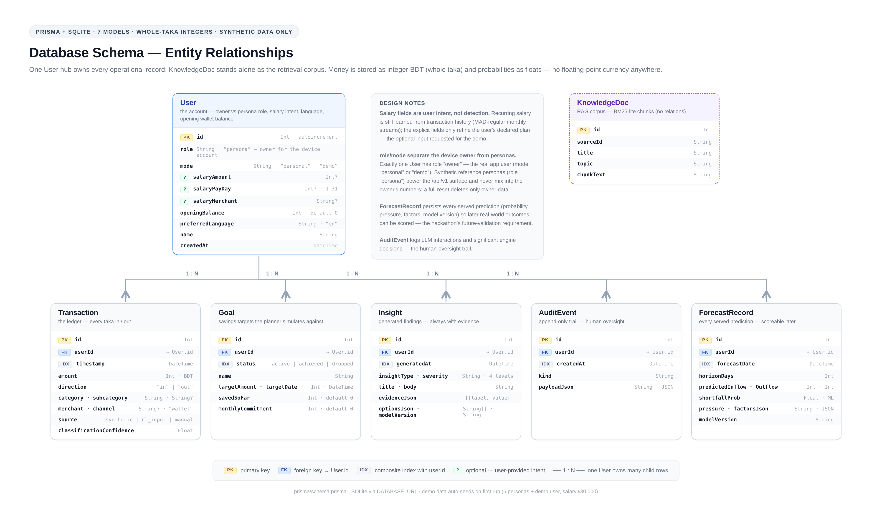
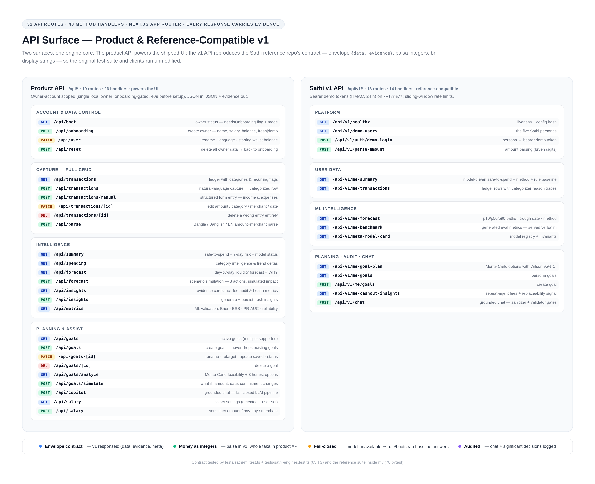

# Sathi (সাথী) — AI Financial Copilot for upay

> **AI Hackathon 2026 · DIU CPC × upay · Track 03: Customer Innovation & Financial Independence**

A Bangla-first financial copilot that tells wallet users **ahead of time** when they will run short, shows how much is **safe to spend**, builds savings plans with honest trade-offs, and explains every prediction with evidence — with all money computed by **auditable deterministic engines and ML models, never by the LLM**.

Built as a production-grade Next.js 16 app. This repository is a self-contained rebuild of the Sathi reference architecture (Python/FastAPI prototype → Next.js/TypeScript) with the full cash-flow intelligence layer, **plus the complete Sathi ML pipeline**: the trained LightGBM quantile forecaster runs inside this app (bit-identical to the Python booster) and its offline Python training/evaluation pipeline lives at `ml/`.

---

## 1. Project Overview

**Problem.** Low- and irregular-income mobile-wallet users (garment workers, gig riders, remittance households) suffer month-end shortfalls caused by income/expense **timing mismatches**, habitual cash-outs leak fees, and raw transaction lists are unreadable. Users discover problems only when the money is already gone.

**Solution.** Sathi turns transaction history into six capabilities:

1. **Understand** — deterministic category analytics, recurring-pattern detection (including salary timing, learned from history — never from config), anomaly flags, cash-out behaviour, month-end dry-spell detection.
2. **Predict** — the **merged Sathi ML forecaster**: LightGBM quantile models for daily irregular net flow + detected recurring streams + calibrated path simulation → P(shortfall) before the next income, trough day, daily p10/p50/p90 balance bands and the **model-based safe-to-spend**. The in-product shortfall-risk classifier (logistic regression, leakage-safe features) is kept as a second, separately-validated model.
3. **Protect** — a **safe-to-spend** engine: model-based `Q₀.₁₀(min future balance) − personal floor`, with the deterministic rule (`cash on hand − upcoming commitments − safety buffer − prorated savings`) kept alongside as the labelled baseline.
4. **Plan** — goal feasibility with capacity from complete months, three honest scenarios, Monte Carlo with Wilson 95% intervals, and what-if simulation.
5. **Explain** — every number ships with evidence; an optional LLM rewrites explanations in Bangla/English under strict numeric grounding (fail-closed).
6. **Own your data** — a local-first, single-owner app: onboarding asks your name (default: Adil Shamim), every record is editable or deletable (transactions, income sources, goals, salary, starting balance), conversations persist on-device, and a double-confirmed **Reset / delete all data** returns the app to a clean slate.

**Purpose.** Empower the customer with foresight and honest options. Sathi never moves money, never nudges spending, and never makes autonomous financial decisions.

## 2. Features & How AI Is Used

| Feature | AI/Engineering | Why a simple rule is not enough |
|---|---|---|
| Shortfall risk (7/21 days) | **LightGBM quantile forecaster** (9 quantiles, pinball loss, direct multi-horizon) + recurring-stream detection + block-correlated calibrated paths (ρ = 0.4), P(shortfall) Platt-recalibrated; plus the in-product logistic classifier with Brier/BSS/PR-AUC validation | A fixed rule can't weigh income timing, obligations and volatility together; the model calibrates probability |
| Cash-flow forecast | Model daily irregular-flow quantiles × the user's own scale + sampled stream dates/amounts; 400 simulated wallet paths | Point estimates mislead; ranges + probability are honest |
| Safe-to-spend | Model-based: Q₀.₁₀ of the simulated minimum balance before the next income, minus the personal floor (3 × own median daily outflow). Rule baseline kept alongside for comparison | Raw balance ignores upcoming obligations and spending uncertainty |
| Recurring detection | Leakage-safe stream detection: (type, counterparty) keys, weekly/fortnightly/monthly MAD-regularity, side-payment filtering, monthly day-of-month anchors | Persona/config-based assumptions don't survive real jitter |
| Goal planning | Monte Carlo over the user's own surplus distribution with Wilson 95% intervals and three honest option types | Deterministic projections hide uncertainty |
| Cash-out fee audit | Repeat-agent detection + replaceability signal (withdrawal followed ≤2 days by a digital-capable payment ≥50%) | Fee leakage is invisible without substitution analysis |
| Cash-on-hand v2 | Per-user exponential decay with the user's own cash-out cadence; stream cash-outs (e.g. rent paid in cash) excluded | A fixed 7-day linear decay misfits every cadence |
| Financial-health metrics | Buffer days, income volatility (CV), cash dependency, fee leakage, fixed-commitment ratio | Standardized metrics enable honest self-assessment |
| Bangla copilot | Intent routing → deterministic engines → RAG (BM25-lite) → LLM summary rewrite with **numeric grounding validation**; fails closed to deterministic templates; 20 s LLM timeout + client-side abort so the UI never hangs | A free-form LLM invents numbers; here every ৳ figure must exist in engine evidence |
| NL expense capture | Deterministic Bangla/Banglish/English parser (Bangla digits, word-boundary keyword matching, confidence + human confirmation) | Keywords must not false-match ("recharge" ⊅ "cha") |
| Full personal-data CRUD | Structured form + NL capture for income **and** expenses; tap-to-edit any transaction (amount/category/merchant/date), delete with confirm; multi-goal create/edit/delete; salary and starting-balance settings | A personal ledger you cannot correct is a ledger you stop trusting |

**Fail-closed LLM architecture** — the LLM never calculates, modifies, or invents financial numbers. If the AI gateway is unavailable or the answer fails grounding validation, the deterministic answer is shown (`llmEnhanced: false`). The product always works. The forecaster is fail-closed in the same way: if the model artifacts are unavailable, the deterministic rule and bootstrap baselines serve the request.

## 2b. Architecture & System Design

Four figures tell the whole story. Sources: `scripts/diagrams/*.html` + `scripts/diagrams/render_diagrams.py` (Playwright renders) → `docs/diagrams/*.png`.

### System architecture — four layers, one deployable



**Clients** (bilingual PWA + Capacitor Android shell) call **32 API routes (40 method handlers)** on two API surfaces — the product API that powers the UI (owner-account scoped: onboarding-gated, full CRUD, reset) and the reference-compatible `/api/v1/*` with its `{data, evidence}` envelope, HMAC demo tokens and sliding-window rate limits. Routes make **pure function calls** into the intelligence layer (`src/lib/engine/`, 32 modules) — no network hops, no hidden state — which reads **Prisma/SQLite** (7 models), the pinned **ml-artifacts** (9 LightGBM boosters + calibration), the RAG corpus, and the audit log. Cross-cutting guardrails (fail-closed LLM, evidence on every number, baselines always reported, synthetic-data-only) are enforced on every request.

### The AI layer split — who computes what



Layer 1 **deterministic engines** own every ৳ figure (auditable, same inputs ⇒ same taka). Layer 2 **ML** owns calibrated probability — LightGBM quantile ensemble, Platt-mapped P(shortfall), block-correlated liquidity paths — always validated against baselines on frozen held-out users. Layer 3 **LLM** owns words only: every draft passes a 4-gate fail-closed pipeline (sanitize 14 injection patterns EN+BN → ground on engine numbers → draft → numeric parity validation), and any failure falls back to deterministic bn/en templates. Layer 4 **RAG** grounds conversational answers in a cited 10-doc corpus.

### Database schema — one hub, one corpus, one trail



`User` is the hub: it owns `Transaction` (the ledger, indexed by `userId, timestamp`), `Goal`, `Insight` (evidence JSON on every finding), `AuditEvent` (append-only oversight trail) and `ForecastRecord` — every served prediction is persisted with its model version so it can be scored against future real-world outcomes (the hackathon's future-validation requirement). `KnowledgeDoc` stands alone as the retrieval corpus. Money is stored as integer BDT; no floating-point currency anywhere.

### API surface — 32 routes, two contracts



The product API (19 routes · 26 handlers: account & data control / capture with full CRUD / intelligence / planning & assist) serves the shipped UI; the v1 API (13 routes · 14 handlers: platform / user data / ML intelligence / planning & audit / chat) reproduces the Sathi reference contract exactly — paisa integers, bn display strings, reason traces, evidence blocks — so the reference test-suite and clients run unmodified against this app.

## 3. Technology Stack

- **Frontend:** Next.js 16 (App Router) · React 19 · TypeScript · Tailwind CSS 4 · shadcn/ui · Framer Motion · TanStack Query · Inter + Hind Siliguri
- **Backend:** Next.js API routes (TypeScript) · Prisma ORM · SQLite
- **ML (serving, in this app):** pure-TypeScript **LightGBM text-model predictor** (`src/lib/engine/lightgbm.ts`) running the exact boosters trained by the Python pipeline (`ml-artifacts/forecast/`) — predictions verified **bit-identical** to Python lightgbm 4.5.0; plus the pure-TS logistic risk classifier with Brier / BSS / PR-AUC / ROC-AUC / reliability evaluation
- **ML (training/eval, `ml/`):** the offline Python pipeline — data generator (2,000 balanced users + drifted cohort), LightGBM training, conformal + Platt calibration, and the T1–T7 evaluation suite (`cd ml && pytest -q` → 78 passed)
- **AI:** z-ai-web-dev-sdk (server-side only) for grounded explanation rewriting
- **Data:** seeded synthetic generators (mulberry32 PRNG) with documented injected patterns

## 4. Requirements

- Node.js 20+ (or Bun 1.1+)
- Python 3.11+ only if you want to re-run the `ml/` training/evaluation pipeline (see section 8c)
- No external services required — the LLM enhancement degrades gracefully without credentials

## 5. Installation & Setup

```bash
bun install          # or npm install
bun run db:push      # create the SQLite schema
bun run dev          # http://localhost:3000
```

**First launch** opens onboarding: enter your name (defaults to **Adil Shamim**), optionally set salary and current wallet balance, then choose **Start fresh** (empty personal ledger) or **Explore with demo data** (6 months of seeded synthetic history, clearly labelled, resettable anytime). No user or data is ever created behind your back.

## 5b. Personal Data, Privacy & Data Control

- **Local-first storage.** All data lives in the local SQLite database file (`db/custom.db`) plus browser `localStorage` for UI preferences and copilot history. Nothing is uploaded to any server; deleting the app (or the database file) removes the data with it — the standard platform storage behaviour.
- **Everything is editable.** Salary and pay-day (header wallet icon → Salary settings), name / language / starting balance (Settings), every transaction (tap any row → edit amount, category, merchant, date, or delete), income sources (structured form → Income), goals (multiple simultaneous goals; rename, retarget, update saved-so-far, mark achieved, or delete).
- **Fresh starts are real.** Settings → *Reset / delete all data* (double confirmation) wipes the owner's transactions, goals, insights, audit trail, forecast records and account, and clears device-local copilot history — the app returns to onboarding. The synthetic reference personas that power `/api/v1` are intentionally preserved for evaluation.
- **What leaves the device.** Only the copilot's question plus already-computed aggregate evidence is sent to the AI language service for phrasing (fail-closed, 20 s timeout). Raw transactions never leave the device. The LLM never produces numbers — every ৳ figure is computed by deterministic engines and validated against the evidence before display.
- **Insights never go stale.** Every data mutation invalidates persisted insights; the next read regenerates them from current data.

## 5c. Deploying (Vercel / self-hosted)

The app is serverless-ready: on a fresh or empty database it creates its own
schema and seeds on first request (no `db push` needed).

**Vercel (demo-grade):**

1. Import the GitHub repo. **Root Directory: leave empty (repo root)** — the
   Next.js app lives at the top level, not in `web/`.
2. Add the environment variable `DATABASE_URL = file:/tmp/sathi.db`
   (Production + Preview). The serverless filesystem is read-only except
   `/tmp`; the app creates and migrates that database automatically.
3. Deploy. Build command (`bun run build`), install (bun) and framework
   (Next.js) are auto-detected; `ml-artifacts/` is traced into the functions
   so the model forecasts work.
4. **Know the trade-off:** data lives per serverless instance and resets on
   cold starts — fine for a demo, not for personal use. For persistent hosted
   data, either point `DATABASE_URL` at Postgres (Neon/Supabase free tier;
   change `provider` in `prisma/schema.prisma` and run `bun run db:push`
   once) or self-host.

**Self-hosted / VPS (persistent, recommended for personal use):**

```bash
bun install && bun run db:push && bun run build
DATABASE_URL=file:./db/custom.db PORT=3000 bun run start   # standalone server
```

The Android shell (`android/`) loads whichever deployment URL you set in
`capacitor.config.json`.

## 6. Environment Variables

| Variable | Purpose |
|---|---|
| `DATABASE_URL` | SQLite connection string (preconfigured to `file:./db/custom.db`) |
| `SATHI_ML_ARTIFACTS` | (optional) override the model artifacts directory; defaults to `./ml-artifacts/forecast` |
| (optional) AI gateway credentials | If absent, the copilot runs in deterministic mode — all features still work |

No secrets are committed; placeholders only.

## 7. Run & Build Commands

```bash
bun run dev      # dev server
bun run lint     # ESLint (clean)
bun run test     # engine test suite (83 tests, incl. LightGBM parity, leakage, empty-ledger safety & CRUD validation)
bun run db:push  # sync Prisma schema
bun run build    # production build (standalone; ships ml-artifacts with the server)
```

## 8. Live Deployment URL

The app runs on the sandbox preview URL (port 3000). _(Fill the public URL here after publishing.)_

## 8b. Sathi v1 API (reference-repo API surface, integrated — now model-driven)

The full Sathi reference backend API is reproduced inside this product under `/api/v1/*` —
including its auth, evidence blocks, personas, and the fail-closed chat pipeline. The UI is unchanged; this is the same product with the reference project's complete API running inside it, **now powered by the merged ML forecaster** (bootstrap/rule fallbacks kept).

**Auth flow (demo personas):**

```bash
# 1. list the five Sathi personas
 curl localhost:3000/api/v1/demo-users

# 2. exchange a persona for a demo token
TOKEN=$(curl -s -X POST localhost:3000/api/v1/auth/demo-login \
  -H 'Content-Type: application/json' \
  -d '{"user_id":"garment_worker"}' | python3 -c 'import sys,json;print(json.load(sys.stdin)["token"])')

# 3. call any /v1/me/* or /v1/chat endpoint with the token
 curl -H "Authorization: Bearer $TOKEN" localhost:3000/api/v1/me/summary
```

| Endpoint | Method | Purpose (reference equivalent) |
|---|---|---|
| `/api/v1/healthz` | GET | liveness probe |
| `/api/v1/demo-users` | GET | the five personas (garment worker, gig driver, remittance household, shopkeeper, student) |
| `/api/v1/auth/demo-login` | POST | signed demo token (HMAC, 24h) |
| `/api/v1/me/summary` | GET | metrics bundle + **model-based safe-to-spend** (`method`, `rule_safe_to_spend_*`, `shortfall_prob`, `model_version` fields; rule baseline kept) + cash-on-hand + recurring + categories + insights + evidence block |
| `/api/v1/me/transactions` | GET | paged list with per-transaction category **reason trace** (rule id + bn/en reasons) |
| `/api/v1/me/forecast` | GET | **LightGBM quantile forecaster + recurring streams + calibrated paths**: P(shortfall), median trough date, daily p10/p50/p90 quantiles (bootstrap fallback if artifacts missing) |
| `/api/v1/me/goal-plan` | POST | **Monte Carlo goal planner**: three honest option types with Wilson 95% intervals from the user's own surplus history |
| `/api/v1/me/cashout-insights` | GET | repeat-agent cash-out audit with replaceability signal and avoidable fees at the labelled rate |
| `/api/v1/me/goals` | GET/POST | saved goals (no money moves — records the plan only) |
| `/api/v1/me/benchmark` | GET | **evaluation served verbatim from the generated artifacts** (eval.json / benchmark.json — no hand-typed numbers): Brier vs bootstrap/rule/base-rate, quantile loss, early-warning precision/recall, fairness, robustness, ablations, SHAP + the in-product classifier validation |
| `/api/v1/meta/model-card` | GET | responsible-AI model card (both models, live metrics) |
| `/api/v1/parse-amount` | POST | deterministic Bangla/Banglish/English NL amount+category parser (rate-limited) |
| `/api/v1/chat` | POST | fail-closed chat: sanitize → intent → engine context → LLM draft (z-ai) → **numeric validation** → reviewed bn/en template on any failure |

All responses are envelope-shaped `{ data, evidence }` with the reference's evidence block
(data window, model versions, labelled assumptions, config hash, validator status).
Rate limits: 10 chats/min, 20 parses/min, 10 logins/min (in-memory sliding window).

**Personas** (synthetic, seeded — reference `config/personas.yaml` ported): the garment
worker is the hero — salary ৳18,000 on the 7th, obligations ৳8,500, habitual agent cash-outs
with digital-substitution injection, month-end dry spells, and the reference's documented
insufficient-balance rule (inflows first each day; an outflow beyond the balance is skipped).
Offline snapshot bundles for all five personas ship at `public/demo/*.json`.

**Android shell:** the reference Capacitor wrapper is included at `android/`
(`com.upay.sathi`) with the APK build workflow at `.github/workflows/android-apk.yml`.

## 8c. The Sathi ML pipeline (`ml/`)

The Sathi **Python ML pipeline** — the reference repository with the ML handoff branch
(`ml/06-eval`) merged — lives inside this repo at `ml/`. It is the offline source of
truth for training and evaluation; the Next.js app serves the resulting model from
`ml-artifacts/`. It has no runtime role — the app never imports or executes it.

```bash
cd ml
pip install -r requirements.txt -r requirements-dev.txt   # adds shap + matplotlib
export DATABASE_URL=sqlite:///./data/sathi.db             # python side uses its own db
rm -f data/sathi.db                                       # forces a reload of the new dataset
pytest -q                                                 # → 78 passed

make data     # (optional, ~15 min) regenerate the seeded synthetic dataset:
              #   2,000 balanced users + 500-user drifted cohort + cash-pocket ground truth
make train    # (optional, ~15 min) train + calibrate the 9 quantile boosters
make eval     # (optional, ~10 min) rebuild the T1–T7 metrics + eval report (promote flow: ml/README.md)
make run      # the original FastAPI service on :8000
```

**What the merged ML work changed** (branch `ml/06-eval`, 7 commits):

1. **Removed hand-typed metrics** — `benchmark.json` and `eval_report.md` are generated only by `ml/evaluate.py`; this app's `/api/v1/me/benchmark` serves those artifacts verbatim.
2. **Fixed data leakage** — the model never reads the salary day from persona config; every feature is computed from history strictly before the forecast origin (a regression test in `tests/sathi-ml.test.ts` enforces this on the TypeScript port too).
3. **New synthetic data** — 2,000 balanced users plus a 500-user drifted test cohort, with realistic garment wages (grade-7 RMG gazette).
4. **New forecaster in the API** — LightGBM quantile models + recurring bill detection + simulated balance paths; forecast and safe-to-spend come from the model (rule kept as baseline).
5. **Full evaluation T1–T7** — pinball/WAPE/coverage/CRPS, shortfall early warning (Brier 0.024 vs rule 0.053, BSS vs rule +0.546), fairness by persona and income band, robustness under ±30% feature noise and drift, ablations, goal-planner back-test, SHAP explainability. See `docs/eval_report.md` (generated by the pipeline, promoted from `ml/`).

**How the model reaches this app:** `ml-artifacts/forecast/fc-2026-09-30-15d8427d/` holds the 9 boosters, `calibration.json` (conformal widening, ρ, block days, Platt coefficients) and `metadata.json`. `src/lib/engine/lightgbm.ts` parses the LightGBM text format and predicts — the parity fixture (`tests/fixtures/lgb-predictions.json`, generated with Python lightgbm 4.5.0) proves the TypeScript predictor matches the Python booster **exactly** (all 9 models × 24 rows, diff 0).

## 9. Testing Instructions

**API smoke tests (all return 200):**

```bash
curl localhost:3000/api/boot          # owner status (needsOnboarding + mode)
curl localhost:3000/api/summary       # snapshot + safe-to-spend + shortfall risk
curl localhost:3000/api/forecast      # forecast + ML risk + evidence + action cards
curl localhost:3000/api/metrics       # ML validation vs rule baseline + NL parser accuracy
curl -X POST localhost:3000/api/copilot -H 'Content-Type: application/json' \
     -d '{"question":"আগামী সাত দিনে ঘাটতির ঝুঁকি কত?"}'

# Personal-data CRUD (owner-gated; 409 until onboarding completes):
curl -X POST localhost:3000/api/transactions/manual -H 'Content-Type: application/json' \
     -d '{"amount":8500,"direction":"in","category":"income","merchant":"Freelance"}'
curl -X PATCH localhost:3000/api/transactions/1 -H 'Content-Type: application/json' \
     -d '{"amount":9000}'
curl -X DELETE localhost:3000/api/transactions/1
curl -X POST localhost:3000/api/reset   # delete all owner data → back to onboarding

# Sathi v1 API (see section 8b) — model-driven:
TOKEN=$(curl -s -X POST localhost:3000/api/v1/auth/demo-login -H 'Content-Type: application/json' \
  -d '{"user_id":"garment_worker"}' | python3 -c 'import sys,json;print(json.load(sys.stdin)["token"])')
curl -H "Authorization: Bearer $TOKEN" localhost:3000/api/v1/me/forecast   # method: lightgbm-quantile + streams + calibrated paths
curl -H "Authorization: Bearer $TOKEN" localhost:3000/api/v1/me/summary    # safe_to_spend.method: "model"
curl -H "Authorization: Bearer $TOKEN" localhost:3000/api/v1/me/benchmark  # T1–T7 from the generated eval artifacts
```

**Engine unit tests** (`bun run test`, 83 tests):

- *Original suite (40):* money arithmetic (reference hand-check ৳1,000 @ 150 bps = ৳15), categorizer rule chain, block-bootstrap simulation determinism + shortfall stats, Monte Carlo planner (monotonicity, Wilson intervals, three option types), prompt sanitizer (EN+BN injection patterns), numeric validator (Bangla digits, comma thousands), template rendering, orchestrator fail-closed behaviour, bilingual formatting, cash-out detector, Dhaka timeutils, persona generator determinism.
- *ML handoff suite (25):* **LightGBM predictor parity vs Python** (all 9 quantile models, 24 fixture rows, exact match incl. missing-value semantics), leakage-safe income timing (monthly/daily/capped/no-history, future-invisibility), inverse-CDF recovery, block-uniform uniformity + correlation, **safe-to-spend keeps P(shortfall) = α** on a toy random walk, stream detection (salary vs random merchants, side payments, origin-invisibility), monthly-anchor stream flows on schedule, cash-on-hand v2 decay, full-forecast invariants for all five personas (paths ≥ 0, quantile ordering, determinism), **origin features unchanged by future transactions**, ledger reconstruction, CRC32 stable seeds.
- *App suite (18, personal-use):* **empty-ledger safety** (computeAll / analytics / forecast / insight generation with zero transactions never crash or NaN; shortfall risk returns an honest no-data result instead of a scary extrapolation), **CRUD input validation** (manual create + patch + goal patch: amounts, categories, directions, date windows, status transitions, numeric-string amounts), and the mutation-freshness contract.

**Python suite** (`cd ml && pytest -q`): **78 passed** — the pipeline's own tests (core engines, API integration, data generator, forecast paths, income timing).

**Manual demo script (demo mode: salary ৳30,000 around day 2, goal ৳30,000 in 6 months):**

1. **Onboarding** — first launch asks your name (default Adil Shamim); choose *Explore with demo data* for the scripted demo, or *Start fresh* for a personal ledger.
2. **Home** — note *Estimated safe-to-spend ৳X* and *shortfall risk next 7 days*.
3. **Transactions → "+ Form"** — add an income (e.g. Freelance ৳8,500) or an expense; or "+ Type" for natural language: `আজকে রিকশা ভাড়া ৮০ টাকা` → parse preview → Save.
4. **Tap any transaction** — edit amount/category/merchant/date or delete it; insights regenerate on the next read.
5. **Cash Flow** — day-by-day forecast, *Why this risk level?* evidence factors, safe-to-spend math, and three simulated actions (expand one to see risk/finance impact).
6. **Copilot** — ask "How much can I safely spend?", "Why do I run short before month-end?", "What if I save ৳1,500 more each month?" — reload the page and the conversation is still there.
7. **Goals** — create a second goal (existing goals stay), run a what-if simulation, edit saved-so-far, mark achieved.
8. **Insights** — expand evidence; check *Model health* (Brier, BSS, PR-AUC, reliability curve).
9. **Salary (header wallet icon)** — set/adjust salary & pay day; watch the forecast refine.
10. **Settings (gear)** — rename, adjust starting balance, review the privacy note, then try *Reset all data* (double confirm) to return to onboarding.

**In-product classifier validation (frozen test users, no leakage):** ML Brier **0.056** vs simple-rule **0.066** (BSS **+15%**), PR-AUC **0.978** vs **0.879**, ROC-AUC **0.982**; climatology Brier 0.250 (BSS +77%). NL parser: **100%** category / **100%** amount on the labelled holdout. **Sathi forecaster (SIMULATED data, `docs/eval_report.md`):** Brier **0.024** vs rule **0.053** (BSS vs rule **+0.546**), on par with the previous bootstrap and better on the drifted cohort; pinball improvement over the best baseline **+4.9%**; daily p10–p90 coverage **84.7%** (nominal 80%).

## 10. Other Configuration

- `src/lib/engine/*` — pure, deterministic engines (no I/O): analytics, forecast, ml, safeToSpend, goals, nlp, insights, knowledge, copilot, actions **+ the Sathi reference ports:** money (bps fee math), timeutils (Dhaka calendar), formatting (Bangla digits), sathiConfig (all reference yaml assumptions incl. the handoff's `shortfall_floor_days`), simulation (block bootstrap), planner (Monte Carlo), cashout (fee audit), metricsEngine, categorizer (rule trace), sathiPersonas (5 reference personas), llmSafety (sanitizer + validator), templates (13 × bn/en), orchestrator (fail-closed chat) **+ the ML handoff ports:** lightgbm (text-model predictor), panel (leakage-safe origin features), forecaster (model inference + Platt recalibration), recurringStreams (income timing + stream detection), liquidity (calibrated path simulation), cashOnHand (v2 estimator), safeToSpend additions (safe-to-spend-from-paths + model status)
- `ml-artifacts/forecast/` — the trained model (9 quantile boosters + calibration + metadata); `SATHI_ML_ARTIFACTS` overrides the location; `next.config.ts` traces it into the standalone build
- `ml/` — the offline Python ML pipeline (data generator, LightGBM training + calibration, T1–T7 evaluation, reference FastAPI service, 78-test suite); promotes its trained output to `ml-artifacts/` — see `ml/README.md`
- `src/lib/server/userForecast.ts` — the app-side `user_forecast()` (reference `api/services/forecast_service.py`): loads the persona history and runs the forecaster with the config's thresholds
- `src/data/eval.json` + `src/data/benchmark.json` — the generated evaluation artifacts served by `/api/v1/me/benchmark` (never edited by hand)
- `src/lib/engine/synthetic.ts` — documented synthetic assumptions (salary day jitter, month-end pressure, festival lift, anomaly spike)
- `src/lib/server/sathiApi.ts` — v1 API infrastructure: demo tokens, rate limiter, evidence builder, persona seeding
- `android/` + `capacitor.config.json` + `.github/workflows/*` — Capacitor app shell, APK + CI pipelines
- `public/demo/*.json` — offline persona bundles (same contract as the reference web app)
- `docs/` — `eval_report.md` (T1–T7), `metrics/` (eval.json, benchmark.json, reliability.png), `model-card.md`, `ML_PLAN.md`, `audit_2026-10.md`, `HACKATHON_COMPLIANCE.md` (§13/§14/§15 verification matrix), `diagrams/` (architecture, AI layers, database, API surface), screenshots
- Prisma models: User (salary settings), Transaction, Goal, Insight, KnowledgeDoc, AuditEvent, ForecastRecord — every prediction is persisted for auditability
- Splits for ML evaluation are **by user** — no user straddles train/test

## Responsible AI & Security

Full verification against the hackathon's §13 Product Readiness, §14 Responsible AI & Safety, and §15 Evaluation criteria — with an evidence pointer for every line — lives in **[`docs/HACKATHON_COMPLIANCE.md`](docs/HACKATHON_COMPLIANCE.md)**.

- **Synthetic data only** — seeded, reproducible, documented assumptions; no real PII (every ML number is labelled SIMULATED)
- **LLM guardrails** — structured output, numeric grounding check (every ৳ in an answer must exist in engine evidence), deterministic fallback, no autonomous decisions, no manipulative nudges
- **Model guardrails** — leakage-safe features (enforced by test), calibration fitted on held-out users only, fail-closed serving (rule/bootstrap fallback), model version + evidence block on every prediction
- **Explainability** — factors, assumptions, confidence, and model version on every prediction; `audit_events` records captures, forecasts, simulations, and queries
- **Human oversight** — low-confidence NL parses require confirmation; actions are options with trade-offs, never commands

## Attribution

UI/UX inspired by Origin (useorigin.com) design language (warm cream, ink, emerald; generous spacing; refined typography) with native-iOS-style interactions. Architecture ported from the Sathi reference repository (Python core engines, ML pipeline) and the first-version upay Copilot prototype. All data is synthetic.
